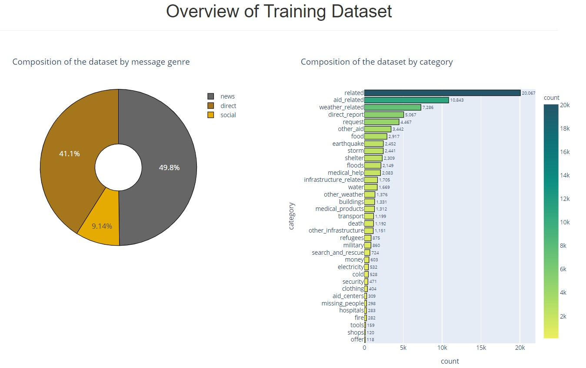
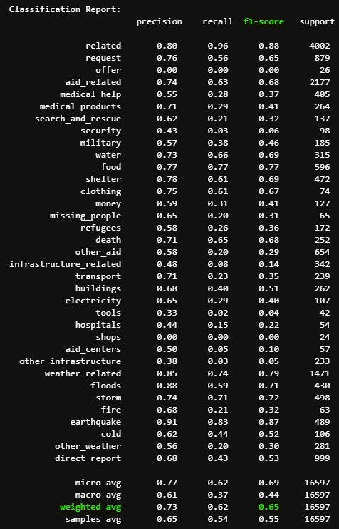
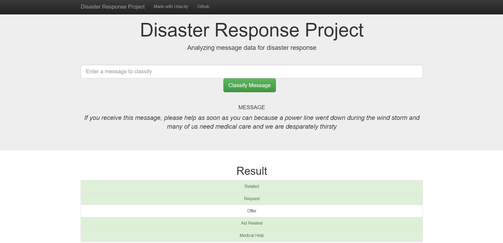
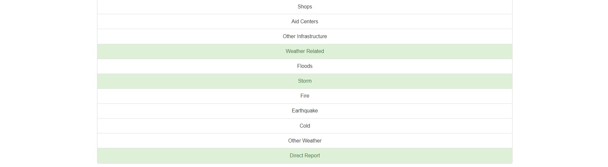

# Disaster Response Pipeline Project

Photo: Mark Wilson/Getty Images

## Table of Contents
1. [How To Use This Repository](#howto)
2. [Supporting Packages](#packages)
3. [Project Motivation](#motivation)
4. [About The Dataset](#data)
5. [File Descriptions](#files)
6. [Methodology](#method)
7. [Results](#results)
8. [Licensing, Authors, and Acknowledgements](#licensing)

## How To Use This Repository 
1. Download and unzip this reqpository to your local machine.
2. Navigate to this directory. For the purposes of running the scripts, this will be the root directory.
3. To run the ETL pipeline that cleans data and stores in a database, type the following in the command line:
        
        python data/process_data.py data/messages.csv data/categories.csv data/CategorizedMessages.db
    
4. To run the ML pipeline that trains classifier and saves, type the following in the command line:
       
        python models/train_classifier.py data/CategorizedMessages.db models/classifier.pkl
       
Note: training the model might take a couple minutes.
       
5. To run the Flask app, type the following in the command line:
       
       python app/run.py
       
6. To view the Flask app being served on your local machine, open up a browser and go to http://localhost:3001/ if you are using Windows, or http://0.0.0.0:3001/ if you are using MacOS.

## Supporting Packages 
In addition to the standard python libraries, this notebook and analysis rely on the following packages:
- Flask https://flask.palletsprojects.com/en/2.0.x/
- plotly https://plotly.com/
- SQLAlchemy https://www.sqlalchemy.org/
- nltk https://www.nltk.org/
- sklearn https://scikit-learn.org/stable/
- xgboost https://xgboost.ai/

Please see `requirements.txt` for a complete list of packages and dependencies utilized in the making of this project

## Project Motivation 
The purpose of this repository is to demonstrate the use of an ETL (extract, transform, load) and machine learning pipeline to develop a text classifier deployed using a Flask web application.

The crux of the problem is how to efficiently and effectively interpret communications transmitted during a natural disaster to best respond with the appropriate forms of aid. This remains a challenge because there is typically a large volume of messages that come from social networks and other sources during a natural disaster. Often only a fraction of messages directly relate to a need for assistance and some requests for help are more urgent than others. It is critical that disaster responders can identify the need (food, water, medical aid, electricity) so that the proper aid organizations can be routed to those affected. In sum, the objective is to produce a multi-label classifier that can categorize messages into one or more categories.

## About The Dataset 

The messages.csv and categories.csv data files contain 26,248 records representing messages communicated during actual events including an earthquake in Haiti in 2010, an earthquake in Chile in 2010, floods in Pakistan in 2010, super-storm Sandy in the U.S.A. in 2012, and news articles spanning a large number of years and 100s of different disasters. Each message maps to one or more of 36 possible categories categories related to disaster response. Note: the "child_alone" category was removed from training because none of the messages had this label, thus no new information was gained from modeling the messages on this label. Messages are provided in their original language, as well as their English translation and they have been stripped of sensitive information. (Source: [Hugging Face Data Summary](https://huggingface.co/datasets/disaster_response_messages))

## File Descriptions 
| File | Description |
| :--- | :--- |
| data/messages.csv | fields: id, message, original, genre |
| data/categories.csv | fields: id, categories (aid_related, water, etc.) |
| data/etl_pipeline_preparation.ipynb | jupter notebook with code used to develop process_data.py |
| data/process_data.py | etl script that cleans the data for analysis |
| data/CategorizedMessages.db | resulting database from running process_data.py | 
| models/ml_pipeline_preparation.ipynb | jupyter notebook used to develop train_classifier.py |
| models/train_classifier.py | script with machine learning pipeline |
| models/classifier.pkl | pickled (byte serialized) version of the model created by train_classifier.py |
| app/run.py | script that initiates a locally hosted Flask server |
| app/templates/base.html | jinja template used to render the main page of the web app |
| app/templates/go.html | jinja template used to render the classification result of the web app |

## Methodology 

### ETL Pipeline
To prepare the messages and categories data for modeling, each file was loaded into a pandas dataframe and an intial pass was made of removing duplicates. Hidden duplicates were identified within the categories data, in which the same id and message occurred more than once with a different set of category labels. This can be seen by using the `.duplicated(keep=False)` method on the categories dataframe. 

Upon further investigation it was noted that for each hidden duplicate pair, one had one ore more fewer labels that appeared relevant to the message. Judgement was used to choose the duplicate with the most "1" labels, oeprating on the assumption that false negatives are worse than false positives. 

After filtering out duplicates using this criterion, the categories data was binarized merged with the messages based on common id. Record id # and original (untranslated) messages were dropped from the dataset since they are not used in modeling. Also, the "child_alone" label was dropped because none of the messages were from this category and it did not provide any additional information. The resulting dataframe was saved to a sqlite database.

### Machine Learning Pipeline
Several algorithms were considered in `ml_pipeline_preparation.ipynb`, including sklearn's support vector classifier, multi-layer perceptron (neural network), random forest, and xgboost's boosted random forest classifier. Ultimately, the `XGBRFClassifier` boosted random forest was chosen because it yielded reasonable precision, recall and f1-scores with significantly faster training time. 

Decision trees, which ensemble to form random forests, are greedy algorithms that proceed to divide a feature space based on the previous state rather than a global optimum. For this reason trees are efficient. Alone they easily overfit, but as an ensemble, boosted by weighting subsequently selected training samples relative to their residual from the previous tree, better generalization can be achieved.

sklearn's `GridSearchCV` class was used to tune the `ngram_range` and `max_features` parameters of the `TfidfVectorizer`, as well as the `learning_rate` parameter of the `XGBRFClassifer`, while also performing 5-fold cross-validation. The best parameter combination turned out to be `ngram_range=((1,2))`, `max_features=10000`, and `learning_rate=0.1`.

## Results 

The flask app provided in this repository has seperately been deployed using [Heroku](https://www.heroku.com/home) and can be found [here](https://disaster-response-flask-webapp.herokuapp.com/) to see what the final app will look like if you run it on your local machine.

The final model learned using the boosted random forest algorithm yielded a weighted average score of 76% precision, 55% recall and 60% F1-score (harmonic mean of precision and recall). Precision is the proportion of positive samples predicted by the model that were in fact positive samples. Recall is the proportion of true positive samples were correctly predicted by the model. Accuracy is the proportion predictions, positive and negative, that were correct classification. Note that although the model's final accuracy happened to be 94.53%, accuracy as a performance metric can be misleading because the dataset used to train on is imbalanced. For example, there are many more messages labeled as "aid_related" than there are for messages labeled as "water", and fewer yet that are labeled as "search_and_rescue". Precision and recall can be more helpful metrics in this context.

 
       

The following images show the output of the app after entering the message, "If you receive this message, please help as soon as you can because a power line went down during the wind storm and many of us need medical care and we are desperately thirsty". Notice that the model appropriately maps "power line" to electricity and "thirsty" to water:

## Licensing, Authors, Acknowledgements 
The data used in this project were curated by [Appen (formerly Figure Eight)](https://appen.com/) and are openly available for use. The dataset was obtained through the [Udacity Data Scientist Nanodegree Program](https://www.udacity.com/blog/2018/05/introducing-udacity-data-scientist-nanodegree-program.html). Please feel free to use the data and code from this repository as you like. Many thanks to the Udacity instructors for their guidance in developing this project.
